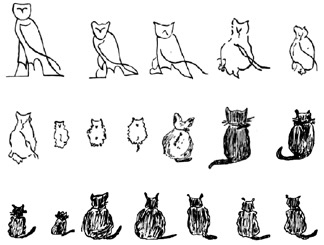

# Bartlett 1932 Demo, drawings

Frederic Bartlett's 1932 book *Remembering* documents early experiments that explore how using and transmitting a memory can affect the memory’s contents. Bartlett wanted to understand how culture shapes memory. Inspired by Philippe (1897), he performed a series of experiments that asked participants to repeatedly recall a memory or to pass it down a chain of people, from one to the next. Bartlett showed that the process of reproduction alters memories over time, causing them to take on features from an individual’s culture. More generally, the methods he developed expose cumulative effects of the forces that reshape and degrade memories and how they impact the structure and veracity of what we remember.

Bartlett, F. C. (1932). Remembering. Cambridge: Cambridge University Press.

In this demo, a drawing is passed down a chain.
